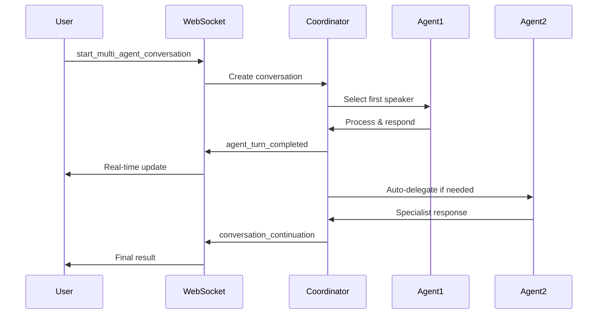

# Agent-to-Agent 실시간 대화 시스템 가이드

## 🎯 개요

Django 백엔드에서 **Agent끼리 서로 대화하는 실시간 시스템**이 구현되었습니다. Context7 A2A 표준을 기반으로 한 완전한 multi-agent conversation 솔루션입니다.

## 🌟 주요 기능

### ✅ 구현된 기능

1. **실시간 Agent-to-Agent 스트리밍** (Context7 A2A 표준)
   - JSON-RPC 2.0 기반 통신
   - Server-Sent Events (SSE) 스트리밍
   - TaskStatusUpdateEvent, TaskArtifactUpdateEvent 지원

2. **Multi-Agent 대화 조율**
   - Turn-taking management
   - Automatic agent selection
   - Context passing between agents
   - Real-time conversation coordination

3. **WebSocket 통합**
   - User-Agent-Agent 3-way 대화
   - 실시간 업데이트 스트리밍
   - 대화 상태 실시간 모니터링

4. **Type-safe Implementation**
   - TypedDict 기반 메시지 구조
   - Enum 기반 상태 관리
   - 포괄적 에러 처리

## 🏗️ 구조

```
agents/worker_agents/
├── conversation_types.py          # Type definitions
├── a2a_streaming.py              # A2A streaming protocol
├── conversation_coordinator.py    # Multi-agent coordination
├── websocket_integration.py      # WebSocket integration
└── worker_manager.py             # Existing agent management
```

## 🚀 사용 방법

### 1. WebSocket 클라이언트에서 사용

```javascript
// Multi-agent 대화 시작
websocket.send(JSON.stringify({
    type: 'start_multi_agent_conversation',
    agent_slugs: ['general-worker', 'flight-specialist'],
    topic: 'Travel Planning',
    message: 'I need help planning a trip to Korea.',
    allow_interruption: true
}));

// 대화 상태 확인
websocket.send(JSON.stringify({
    type: 'conversation_status'
}));

// 특정 agent에게 메시지 전송
websocket.send(JSON.stringify({
    type: 'send_to_conversation',
    target_agent: 'flight-specialist',
    message: 'Can you find flights from Seoul to Busan?'
}));

// 대화 목록 확인
websocket.send(JSON.stringify({
    type: 'list_conversations'
}));
```

### 2. Django 관리 명령어로 테스트

```bash
# 기본 테스트
python manage.py test_agent_conversations

# 커스텀 설정으로 테스트
python manage.py test_agent_conversations \
    --agents "general-worker,flight-specialist,hotel-specialist" \
    --topic "Complete Travel Planning" \
    --message "Plan a 5-day trip to Seoul with flights and accommodation" \
    --duration 120 \
    --verbose
```

### 3. Python 코드에서 직접 사용

```python
from agents.worker_agents.conversation_coordinator import start_multi_agent_conversation

# Multi-agent 대화 시작
conversation_id = await start_multi_agent_conversation(
    topic="Travel Planning",
    agent_slugs=["general-worker", "flight-specialist"],
    initial_message="I need help with travel planning",
    websocket_callback=my_callback_function
)
```

## 📋 WebSocket 메시지 타입

### 새로운 A2A 메시지 타입

| 메시지 타입 | 설명 | 필수 파라미터 |
|------------|------|---------------|
| `start_multi_agent_conversation` | Multi-agent 대화 시작 | `agent_slugs`, `topic`, `message` |
| `join_conversation` | 기존 대화 참여 | `conversation_id` |
| `leave_conversation` | 대화 나가기 | `conversation_id` (optional) |
| `list_conversations` | 활성 대화 목록 | 없음 |
| `conversation_status` | 대화 상태 확인 | `conversation_id` (optional) |
| `send_to_conversation` | 특정 agent에게 메시지 | `target_agent`, `message` |
| `stop_conversation` | 대화 중단 | `conversation_id` (optional) |
| `get_conversation_summary` | 대화 요약 | `conversation_id` (optional) |

### 이벤트 응답 타입

| 이벤트 타입 | 설명 |
|------------|------|
| `multi_agent_event` | 일반 multi-agent 이벤트 |
| `conversation_started` | 대화 시작됨 |
| `agent_turn_started` | Agent 발언 시작 |
| `agent_turn_completed` | Agent 발언 완료 |
| `conversation_continuation` | 대화 연속 (다음 agent로 전환) |
| `agent_switch` | Agent 전환 |
| `conversation_error` | 대화 오류 |

## 🔧 설정

### ConversationRule 설정

```python
from agents.worker_agents.conversation_coordinator import ConversationRule

rules = ConversationRule(
    max_participants=5,          # 최대 참여자 수
    max_turn_duration=120,       # 최대 발언 시간 (초)
    max_conversation_duration=1800,  # 최대 대화 시간 (초)
    auto_escalation=True,        # 자동 escalation
    require_consensus=False,     # 합의 필요 여부
    allow_interruption=True,     # 중단 허용
    turn_timeout=30             # 발언 타임아웃 (초)
)
```

## 📊 모니터링 및 메트릭

### 대화 상태 모니터링

```python
from agents.worker_agents.conversation_coordinator import conversation_coordinator

# 대화 상태 확인
status = conversation_coordinator.get_conversation_status(conversation_id)

# 활성 대화 목록
active_conversations = conversation_coordinator.list_active_conversations()

# 대화 요약
summary = await get_conversation_summary(conversation_id)
```

### 메트릭 정보

- **총 발언 수** (total_turns)
- **대화 지속 시간** (total_duration)
- **평균 발언 시간** (average_turn_duration)
- **Agent별 참여도** (agent_participation)
- **메시지 수** (message_count)
- **성공한 delegation 수** (successful_delegations)

## 🔄 대화 흐름



## 🧪 테스트 시나리오

### 1. 기본 2-Agent 대화
```bash
python manage.py test_agent_conversations \
    --agents "general-worker,flight-specialist" \
    --message "I need flight information"
```

### 2. 복잡한 Multi-Agent 시나리오
```bash
python manage.py test_agent_conversations \
    --agents "general-worker,flight-specialist,hotel-specialist" \
    --topic "Complete Travel Package" \
    --message "Plan a complete 7-day Korea trip with flights, hotels, and itinerary"
```

## 🐛 디버깅

### 로깅 활성화

```python
import logging

# 대화 조율 로그
logging.getLogger('agents.conversation_coordination').setLevel(logging.INFO)

# A2A 스트리밍 로그
logging.getLogger('agents.a2a_streaming').setLevel(logging.INFO)

# WebSocket 통합 로그
logging.getLogger('agents.websocket_integration').setLevel(logging.INFO)
```

### 일반적인 문제 해결

1. **Agent가 응답하지 않음**
   - Agent 상태 확인: `python manage.py test_worker_structure`
   - Neo4j 연결 확인: `python manage.py test_neo4j`

2. **WebSocket 연결 실패**
   - Django Channels 설정 확인
   - Redis/Channel layer 상태 확인

3. **대화가 시작되지 않음**
   - Agent card 검증: Agent discovery 로그 확인
   - 필수 파라미터 확인

## 🔮 향후 개선사항

1. **Voice Integration**: 음성 기반 agent 대화
2. **Advanced AI Coordination**: LLM 기반 대화 조율
3. **Persistent Conversations**: 대화 영구 저장 및 복원
4. **Multi-modal Support**: 이미지, 파일 공유
5. **Performance Optimization**: 대용량 동시 대화 지원

## 📚 관련 문서

- [A2A Protocol Specification](https://a2a-protocol.org/)
- [Context7 Documentation](https://context7.com/)
- [Django Channels Guide](https://channels.readthedocs.io/)
- [WebSocket API Reference](../docs/websocket_api.md)

---

**구현 완료**: Agent-to-Agent 실시간 대화 시스템이 성공적으로 구현되었습니다! 🎉