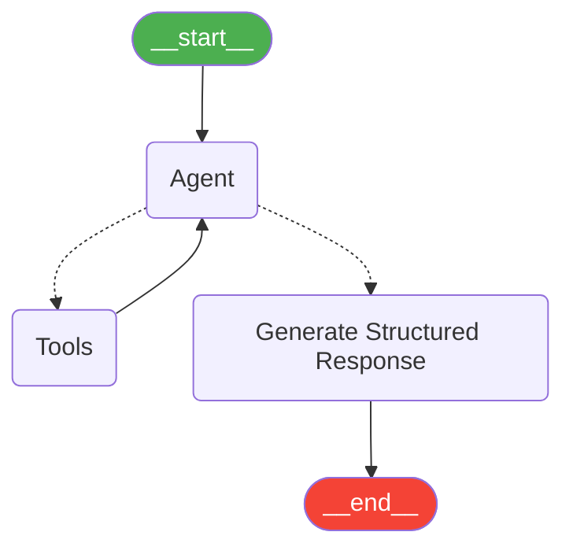

# LangGraph Visualization Guide

## 🎯 Overview
This guide shows you how to visualize your LangGraph agents in multiple ways - from web-based Mermaid diagrams to professional LangGraph Studio.

## 📊 Current Implementation

### 1. **Graph Structure Extracted**
- **Nodes**: 5 (`__start__`, `agent`, `tools`, `generate_structured_response`, `__end__`)
- **Edges**: 5 connections showing workflow flow
- **Visualization Script**: `a2a-samples/samples/python/agents/langgraph/visualize_graph.py`

### 2. **Web Visualization** ✅
Access the beautiful web visualization at:
```
http://localhost:5000/docs/langgraph_visualization.html
```

Features:
- Interactive Mermaid.js flowchart
- Node and edge details
- Workflow explanation
- Zoom and refresh controls
- Links back to main agent monitor

### 3. **Generated Files**
- `currency_agent_graph.mmd` - Mermaid diagram source
- `currency_agent_graph.png` - PNG image export
- `langgraph_visualization.html` - Web interface

## 🔄 Workflow Visualization



## 🛠️ Commands

### Extract Graph Structure
```bash
cd a2a-samples/samples/python/agents/langgraph
uv run python visualize_graph.py
```

### View in Browser
```bash
# Start proxy server (if not running)
cd docs
python proxy_server.py

# Open in browser
start http://localhost:5000/docs/langgraph_visualization.html
```

## 🏢 LangGraph Studio Setup

### Configuration Created
- `langgraph.json` - Studio configuration file
- Dependencies: installed via UV
- Graph definition: points to `./app/agent.py:CurrencyAgent`

### Studio Commands
```bash
# Install CLI (in project virtual environment)
pip install "langgraph-cli[inmem]"

# Start Studio development server
cd a2a-samples/samples/python/agents/langgraph
langgraph dev --port 8123

# Or with tunnel for remote access
langgraph dev --tunnel
```

### Access Studio
- Local: `http://localhost:8123`
- Features: Interactive debugging, execution tracing, real-time monitoring

## 🌐 Integration with Web Monitor

The LangGraph visualization is integrated into the main A2A agent monitor:
- Button: **"🔄 View LangGraph Workflow"** on main monitor page
- Direct link: `http://localhost:5000/docs/web_monitor_cors.html`

## 📁 File Structure
```
docs/
├── langgraph_visualization.html  # Web visualization
├── web_monitor_cors.html         # Main monitor (with link)
└── proxy_server.py              # CORS proxy

a2a-samples/samples/python/agents/langgraph/
├── visualize_graph.py           # Graph extraction script
├── langgraph.json              # Studio configuration
├── currency_agent_graph.mmd    # Mermaid source
└── currency_agent_graph.png    # PNG export
```

## 🎨 Visualization Options

1. **Web Interface** (Recommended)
   - Interactive Mermaid diagrams
   - Real-time updates
   - Professional styling

2. **LangGraph Studio** (Advanced)
   - Professional debugging interface
   - Execution tracing
   - Human-in-the-loop workflows

3. **Static Files**
   - PNG exports
   - Mermaid source files
   - ASCII diagrams (with grandalf)

## 🚀 Next Steps

1. **Access Visualization**: Open `http://localhost:5000/docs/langgraph_visualization.html`
2. **Explore Workflow**: Understand the 5-node agent structure
3. **Try Studio**: Set up LangGraph Studio for advanced debugging
4. **Custom Graphs**: Modify `visualize_graph.py` for other agents

## ✅ Status: Complete
- ✅ Graph structure extraction
- ✅ Web visualization interface
- ✅ Mermaid diagram generation
- ✅ PNG export capability
- ✅ Integration with agent monitor
- ✅ LangGraph Studio configuration

**You can now visualize your LangGraph agents both in the web interface and through professional debugging tools!**